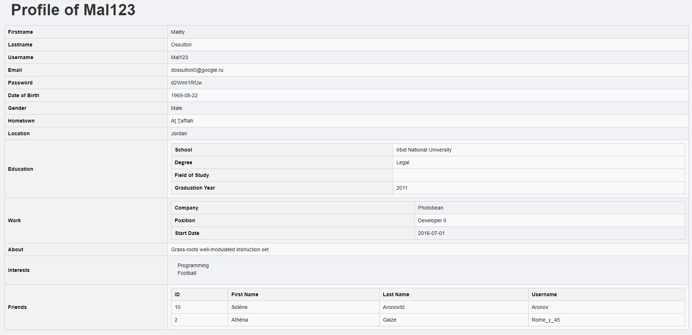

#Social network Neo4j DB Project :
* ####Transform Neo4j profile into a CSV data set using xml created in (xml_DATA/) directory 
* ####Using xml and xslt for creating the html file in (html_pages/) directory
* ####This html shows information about the profile
#

##The neo4j graph of the database:


## The html profile of an individual:


#
####I used py2neo module for retrieving the data set with Graph
```python
from py2neo import Graph
graph = Graph(host="localhost",name="your_collection", auth=("neo4j", "your_password"))
```