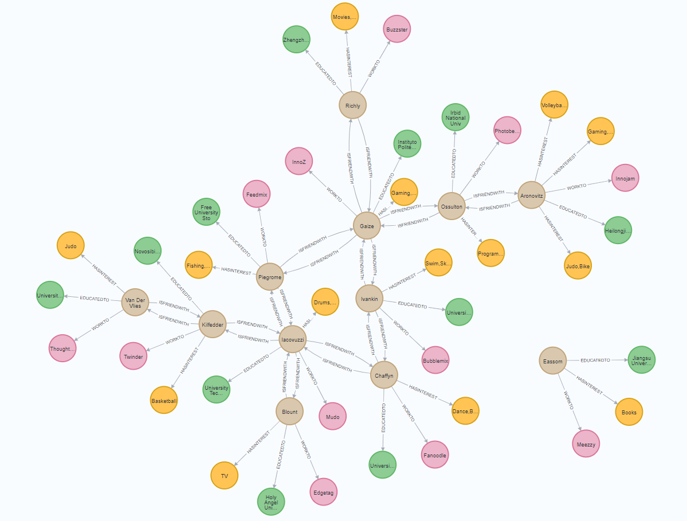

#Social network Neo4j DB Project :
* ####Transform Neo4j profile into a csv data set using xml created in xml_DATA/ directory 
* ####Using xml and xslt for creating a html in html_pages/ directory
* ####This html display information about the profile

##The neo4j graph of the database:

## The html profile of an individual:

